# Como instalar y entrar a visual studio code en una Raspbery

## como isntala visual Studio Code
1. debes entrar directo en el terminal de Rasberry Pi, ara eso habre un terminal directo en Debian y ejecuta el comando `ssh nombreUsuario@NombreEquipo.local`, se le pedira la contraseña para entrar directo en en terminal de Raspberry Pi

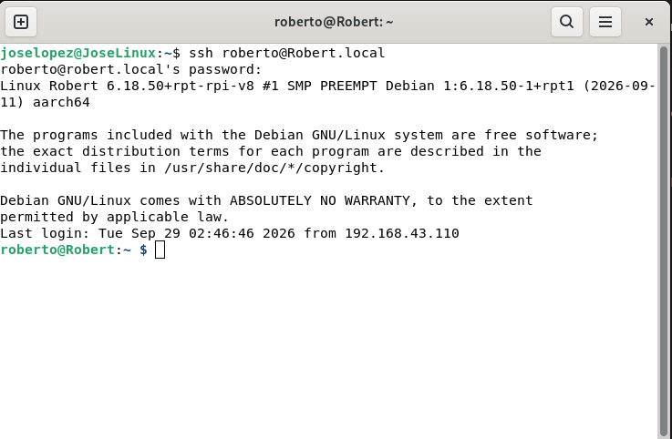

2. Actualiza la lista de paquetes: `sudo apt update`

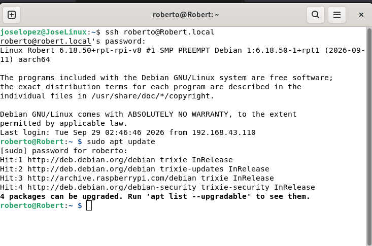

3. Instala VS Code: `sudo apt install code`

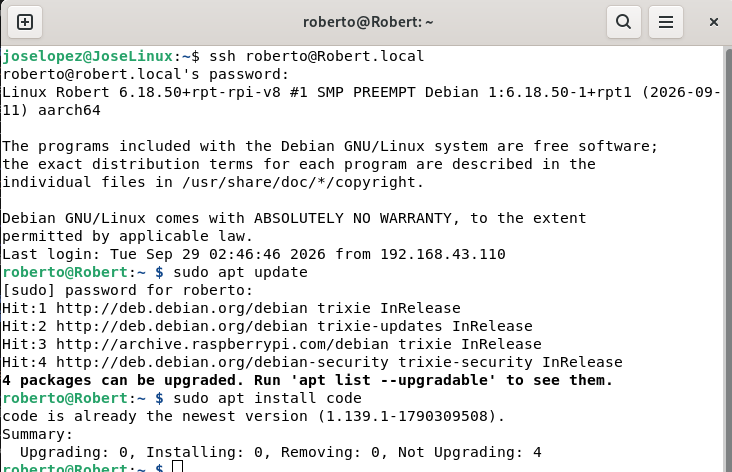

## Como ejecutar visual studio code de Raspberry Pi desde la version de PC

1. Prueba primero que el SSH funciona desde tu PC `ssh nombreUsuario@NombreEquipo.local`

2. Instala la extensión "Remote - SSH" de Microsoft en VS Code de tu PC, para esto tienes que ir directo a extenciones
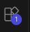
luego buscar la extencion "Remote - SSH"

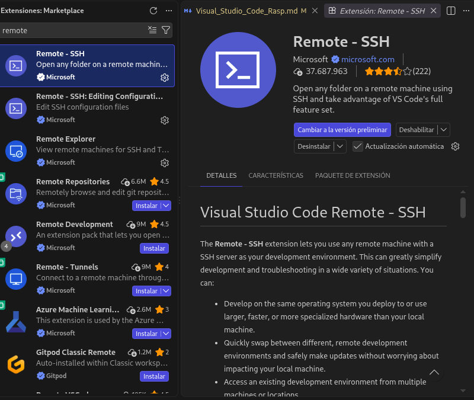

3. luego de instalarla busque en la barra lateral izquierda de visual studio el sigueinte simbolo 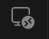, acceda a el, debe de mostarse lo siguiente

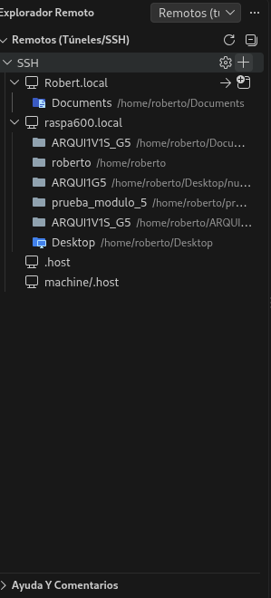

debera de seleccionar el simbolo "+", al hacerlo aparecera lo siguiente 

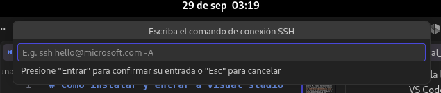 

siga las intruciones y escriba el comando `ssh nombreUsuario@NombreEquipo.local` 

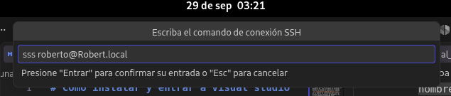 

luego presione la tecla "enter"

4. debera de aparecerle exactamente su dispositivo, uede notar la flecha y el recuadro? pues tiene opciones distintas de abrir Visual Studio Code desde su version de PC

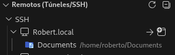

y sea que quiera conectar en la ventana actual 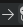 o conectar en una nueva ventana 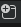, en neustro caso elejiremos la opcion de nueva ventana

5. al abrir la nueva ventana nospide directamente la contrasea de nuestra Raspberry Pi, siga las instrucciones y coloquela, luego presione "enter"

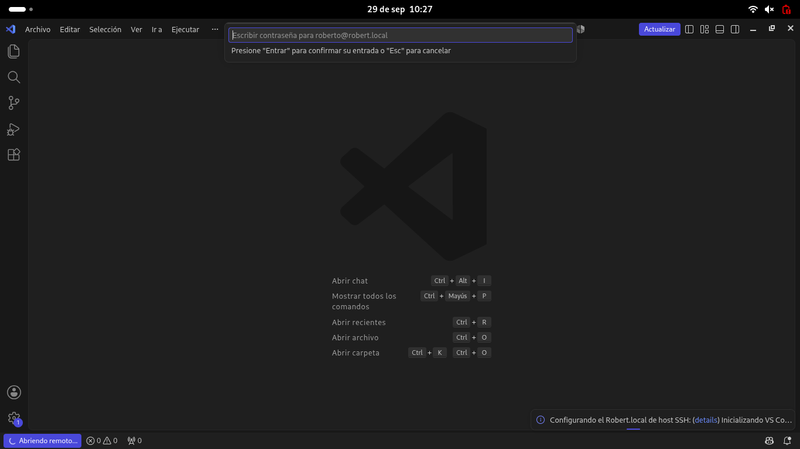

6. listo, estamos dentro del Visual Studio Code de la RaspBerry pi, podemos confrimarlo viendo el recuadro azul en la punta izquierda abajo de la pantalla que muestra el nombre de nuestra Raspberry de local

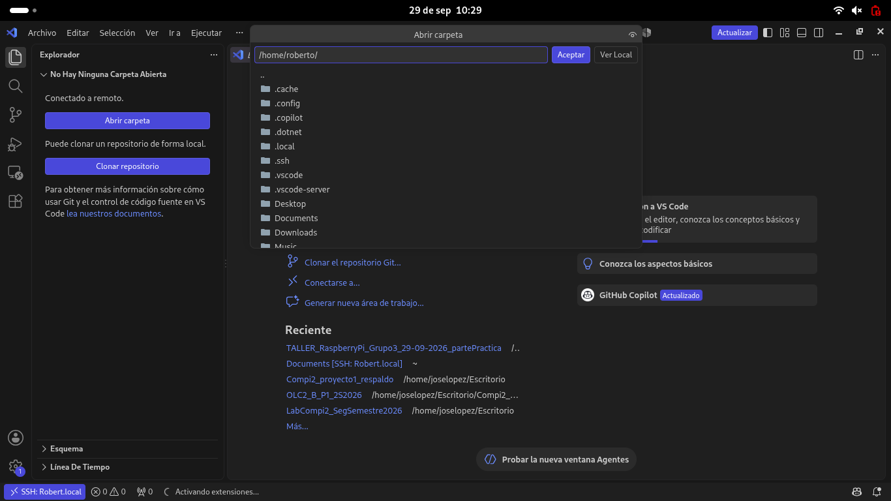

como nota adicional, al contrrio de como pasa en windows o linux normal, para buscar la ubicacion de nuestros archivos devemos de esribir su direccion en carpeta para acceder a ella.
